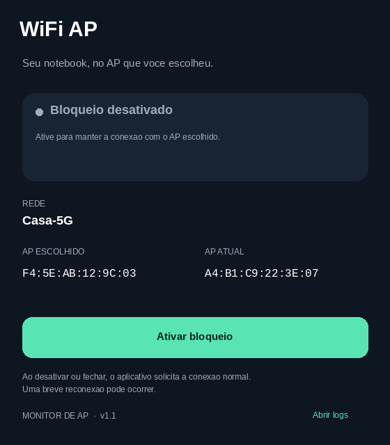

# WiFi AP

Aplicativo Windows com um botão para ativar e desativar a conexão direcionada a um ponto de acesso Wi-Fi (BSSID). Mostra o AP escolhido, o AP atual e o estado da associação.

## Demonstração

## Tecnologia

C# 5, Windows Forms, .NET Framework 4.8, executável x64 e API nativa WLAN via P/Invoke. Não usa servidor, navegador embutido, NuGet ou PowerShell durante o uso normal. PowerShell é usado pelos scripts de compilação e teste.

## Requisitos

- Windows de 64 bits com .NET Framework 4.8 instalado.
- Adaptador Wi-Fi e perfil de rede já configurado no Windows.
- Permissão de Localização para aplicativos da área de trabalho, caso o Windows exija para consultar o BSSID.
- Para abrir a solução: Visual Studio com desenvolvimento para desktop .NET e targeting pack do .NET Framework 4.8.

## Configurar sua rede

O repositório contém somente exemplos. As configurações reais ficam em um arquivo local ignorado pelo Git:

~~~powershell
Copy-Item .\src\WifiAP\App.config .\src\WifiAP\App.local.config
~~~

Edite App.local.config:

- ProfileName: nome exato do perfil Wi-Fi salvo no Windows.
- TargetBssid: endereço do rádio/AP desejado, no formato AA:BB:CC:DD:EE:FF.
- InterfaceGuid: GUID do adaptador Wi-Fi que será controlado.

Consulte esses dados com:

~~~powershell
netsh wlan show profiles
netsh wlan show interfaces
Get-NetAdapter | Select-Object Name, InterfaceDescription, InterfaceGuid
~~~

Não use a opção key=clear: o aplicativo não precisa ler sua senha.

## Compilar e testar

Na raiz do projeto, em PowerShell:

~~~powershell
.\tools\Build.ps1
.\tools\Test.ps1
~~~

O resultado fica em artifacts/WiFi-AP.exe, acompanhado de WiFi-AP.exe.config. Mantenha os dois arquivos juntos e abra o executável com duplo clique.

O build usa App.local.config quando presente; caso contrário, usa os exemplos de App.config. Também é possível editar o .exe.config após compilar e reabrir o aplicativo. Uma nova compilação copia a configuração novamente.

Para trabalhar no Visual Studio, abra WifiAP.sln e compile em Release | x64. Nesse caso, a saída fica em src/WifiAP/bin/Release.

Os testes usam um adaptador simulado: não conectam, desconectam ou reconfiguram o Wi-Fi real. Verificam estruturas nativas, confirmação de associação, intervalos de reconexão, cliques concorrentes, estabilidade do botão, liberação ao fechar, erros, recuperação e logs. O workflow do GitHub executa o build e esses testes no Windows.

## Funcionamento

1. O aplicativo inicia desativado.
2. Ao ativar, solicita conexão ao BSSID escolhido usando o perfil salvo.
3. Consulta o AP atual a cada 3 segundos, inclusive minimizado.
4. Se sair do AP escolhido, solicita nova conexão respeitando pelo menos 30 segundos entre tentativas.
5. Ao desativar ou fechar, solicita conexão sem restrição de BSSID.

O estado de conexão só é confirmado após a consulta ao adaptador. As operações Wi-Fi são serializadas e executadas fora da thread de interface. O botão não muda de aparência durante consultas automáticas.

O aplicativo não testa acesso à internet e não altera DNS, DHCP, perfis ou Registro. Não garante bloqueio no firmware: o driver pode migrar temporariamente entre verificações. Também não corrige defeitos do driver, autenticação WPA3 ou indisponibilidade do AP.

Desative antes de sair do alcance do AP. Uma breve reconexão pode ocorrer ao ativar ou liberar. Se a liberação falhar, a janela informa o erro e suspende tentativas automáticas; tente desativar novamente.

## Logs

Use **Abrir logs** na janela ou acesse:

~~~text
%LOCALAPPDATA%\WiFiAP\Logs\wifi-ap.log
~~~

Registra início/fim, mudanças de AP, desconexões, solicitações e aceites de conexão, erros e recuperação. Inclui perfil, BSSID e horário com fuso; não inclui senhas ou tráfego de navegação. Consultas sem mudança e erros repetidos idênticos não geram uma linha a cada ciclo.

Rotação de aproximadamente 1 MiB por arquivo, com até 4 arquivos anteriores. Falha ao gravar log é mostrada na interface e não interrompe o controle do Wi-Fi.

## Estrutura

~~~text
WifiAP.sln
src/WifiAP/
  WifiAP.cs          Interface, controlador, API WLAN, logs e testes simulados
  WifiAP.csproj      Projeto Windows Forms
  App.config        Exemplos públicos
  app.manifest      Manifesto Windows
tools/
  Build.ps1
  Test.ps1
.github/workflows/build.yml
~~~

## Publicar no GitHub

Crie um repositório vazio no GitHub e, nesta pasta, execute:

~~~text
git init
git add .
git status
git commit -m "Initial commit: WiFi AP"
git branch -M main
git remote add origin URL_DO_SEU_REPOSITORIO
git push -u origin main
~~~

Confira git status antes do commit: configurações locais, executáveis, logs e arquivos de IDE devem ficar fora do Git. Se publicar um executável como release, revise também seu .exe.config para evitar compartilhar os identificadores da sua rede.

## Licença

MIT — veja o arquivo [LICENSE](LICENSE).
